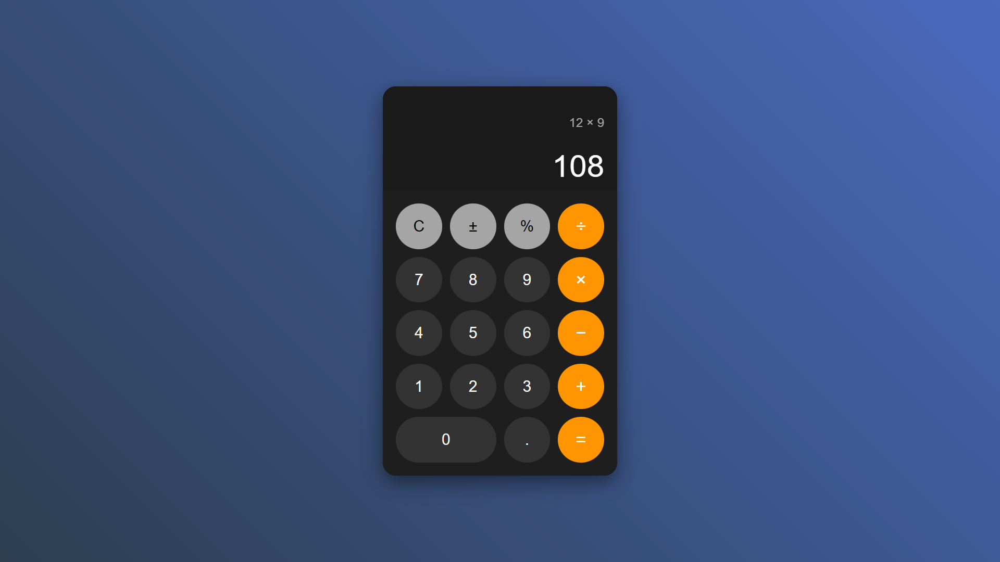

# 🧮 Calculator

A clean, modern calculator built using **HTML**, **CSS**, and **JavaScript**.  
This calculator features a responsive design, smooth animations, and live calculation previews.

---

## ✨ Features

- **Responsive Layout** – Works on mobile and desktop
- **Dynamic Display**
  - Shows typed expression in the **expression area**
  - Displays **live preview of the result** while typing
  - After pressing `=`, expression shrinks and result enlarges
- **Smooth Animations** for display transitions
- **Keyboard Support** for fast input
- **Basic Operations**: `+`, `−`, `×`, `÷`, `%`, sign toggle (±)
- **Clear (C) and Backspace** functionality

---

## 📸 Demo UI

| Typing Expression                 | After Pressing `=`                |
|-----------------------------------|-----------------------------------|
|  |  |

---

## 🛠️ Tech Stack

- **HTML5**
- **CSS3**
- **JavaScript**

---

## 🚀 Getting Started

### 1. Open in Browser
Open `index.html` in any modern web browser.

---

## ⚡ Keyboard Shortcuts

| Key       | Action           |
|-----------|------------------|
| 0-9       | Enter numbers    |
| .         | Decimal point    |
| + - * /   | Operators        |
| Enter or =| Calculate        |
| Esc       | Clear All        |
| Backspace | Delete last digit|

---

## 📂 Project Structure

```
calculator/
├── index.html        # Main HTML file
├── style.css         # Styling for calculator
├── script.js         # Calculator logic
├── screenshots/      # (Optional) Screenshots for README
└── README.md         # Project documentation
```

---

## ✅ How It Works

- **Expression Area** – Displays the input expression as the user types.
- **Result Area**
  - Shows live calculation result while typing.
  - After pressing `=`, the result enlarges and the expression shrinks.

---

## 🔮 Future Improvements

- Add scientific functions (sin, cos, log, etc.)
- Add theme options (Dark/Light modes)
- Implement calculation history

---

## 📜 License

This project is licensed under the **MIT License** – you are free to use and modify it.