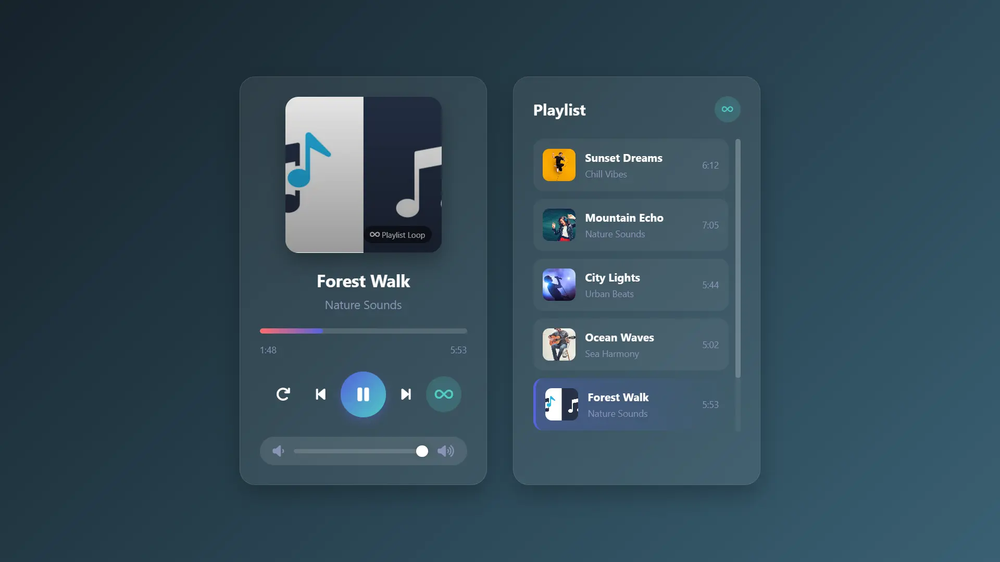

# 🎵 Music Player

A modern, responsive web music player with playlist, loop modes, and a clean glassmorphism UI.

---

## ✨ Features

- **Playback controls**: Play / Pause / Previous / Next
- **Loop modes**: Toggle loop for a single song or the entire playlist (buttons available in controls and playlist header)
- **Dynamic playlist**: Title, artist, cover art, and duration
- **Seek bar**: Click to seek within the track
- **Volume control**: Smooth slider with live updates
- **Loading indicator**: Spinner shown while audio loads
- **Responsive design**: Works on mobile and desktop

---

## 🚀 Getting Started

### 1. Clone the repository

```bash
git clone <this-repository-url>
cd Task-3(musicPlayer)
```

### 2. Run locally

- Option A: Double-click `index.html` to open in your browser
- Option B (recommended): Serve the folder with a simple static server for best compatibility

```bash
# Using PowerShell
pwsh -c "python -m http.server 5500"  # then open http://localhost:5500
```

No build steps required — pure **HTML, CSS, and JavaScript**.

---

## 📂 Project Structure

```
Task-3(musicPlayer)/
├─ index.html
├─ styles.css
├─ script.js
├─ images/
│  └─ *.webp
├─ musics/
│  └─ *.mp3
└─ README.md
```

Dependencies: Icons via Font Awesome CDN (already included in `index.html`).

---

## 🛠️ Customization

To add or modify songs, update the `songs` array in `script.js` and place your files in `images/` and `musics/`:

```javascript
const songs = [
  {
    title: "Your Song Title",
    artist: "Artist Name",
    cover: "./images/your-cover.webp", // or .jpg/.png
    audio: "./musics/your-audio.mp3"
  },
  // more songs...
];
```

Notes:
- Duration appears after the audio metadata loads for each track.
- There are two playlist-loop toggles (one near the player controls, one in the playlist header) kept in sync.

---

## 📸 Demo



---

## 📝 License

This project is licensed under the **MIT License** — feel free to use, modify, and share.
